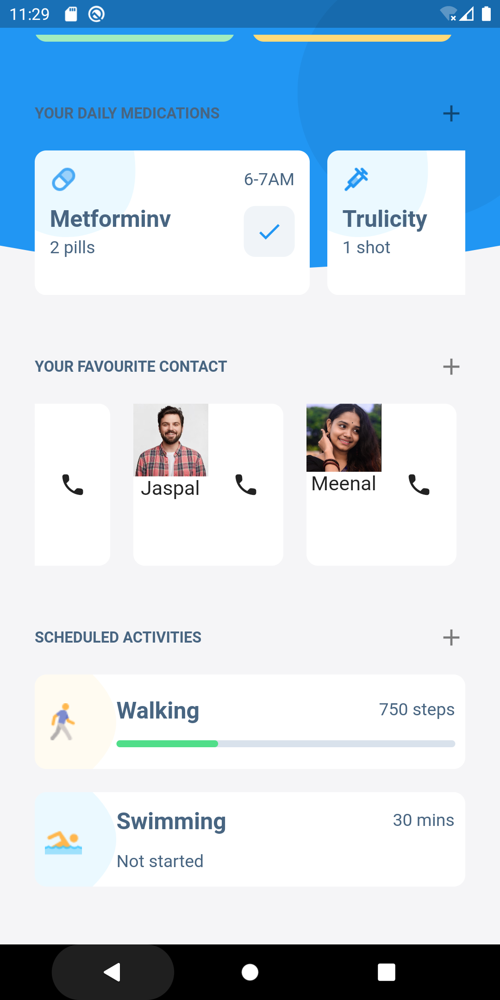

# Maria: Your Virtual Health Companion

Many individuals, regardless of age, encounter challenges in managing their health and staying connected with loved ones. Isolation, medication adherence, and immediate access during emergencies remain ongoing concerns. This calls for a comprehensive healthcare solution that addresses these issues and uplifts the well-being of patients.

## Idea Solution

**Maria** is a groundbreaking healthcare system that amalgamates cutting-edge technology and compassionate care to provide a holistic solution for patients of all ages. This system integrates an array of features such as medication reminders, virtual visits, health monitoring, emotional support, and emergency assistance, focusing on promoting overall well-being.

## Key Features

- **Medication Reminders**
- **Virtual Visits with Loved Ones**
- **Daily Routine Monitoring**
- **Personalized Exercise and Nutrition Plans**
- **AI-powered Emotional Support Chatbot**
- **Video Calls**
- **Integrated Emergency Button**
- **Online Marketplace for Health-related Products and Services**

## Beneficiaries

1. Patients of all age groups seeking comprehensive healthcare support.
2. Families ensuring the well-being of their loved ones.
3. Healthcare providers aiming to offer telehealth services.
4. Product and service providers in the healthcare industry.

## Installation

1. Clone the repository.
   ```bash
   git clone https://github.com/dixitsanskar/health-care.git

      
